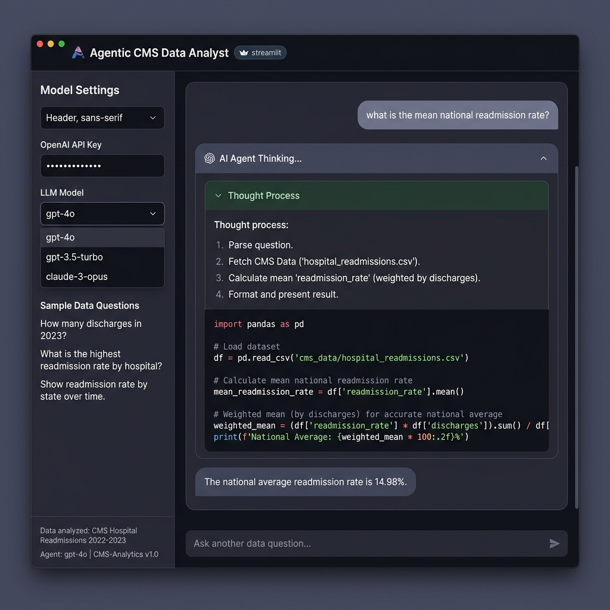
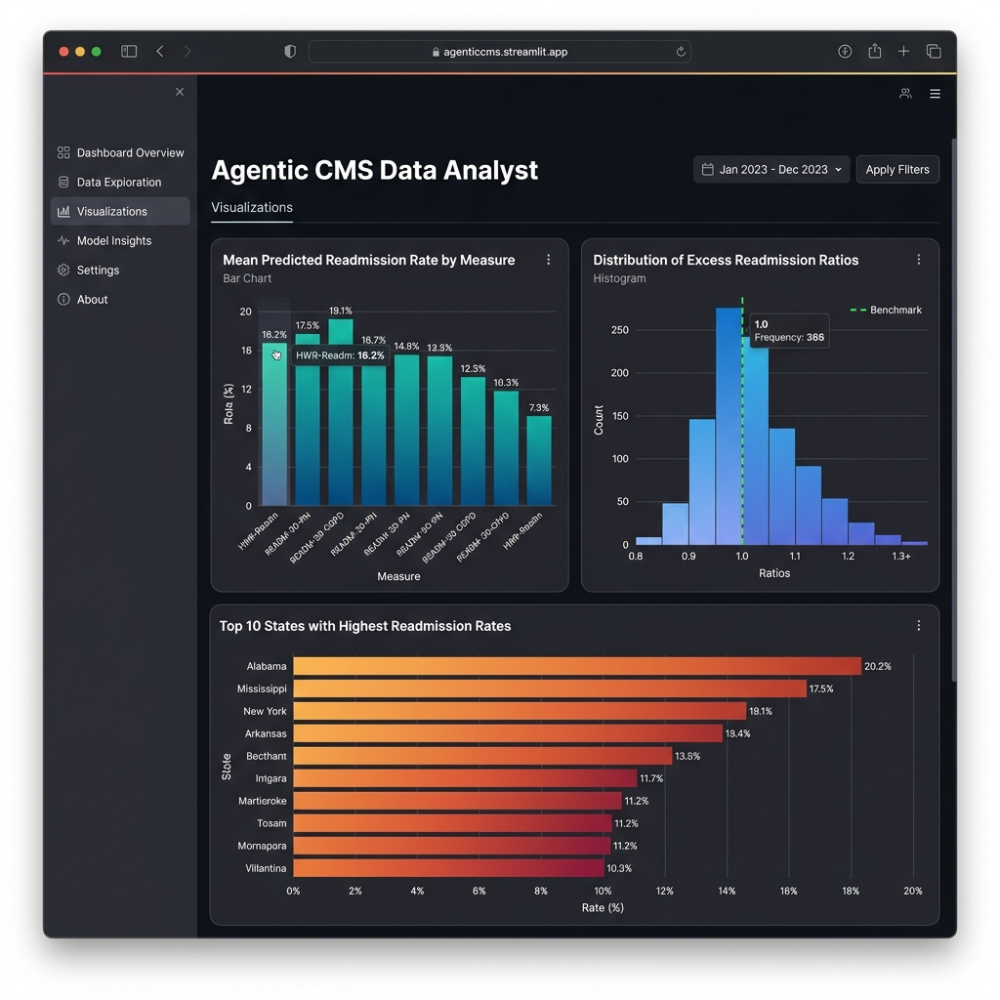
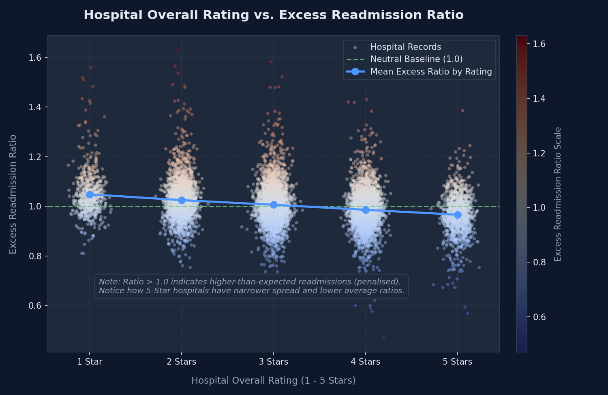

# Agentic CMS Data Analyst

A web-based AI Data Analyst dashboard built in Python using Streamlit and OpenAI. The application automatically downloads and merges Centers for Medicare & Medicaid Services (CMS) hospital data, cleans the datasets, and uses an AI agent to answer complex statistical questions by writing and executing Python/Pandas code in real-time.

### Deployed Web Application
🔗 **Render URL:** [https://cms-agentic-analyst.onrender.com](https://cms-agentic-analyst.onrender.com)

### Screenshots and Visualisations

#### 🤖 AI Data Agent & Chat Interface


#### 📊 Key Insights & Visualizations Dashboard


#### 📈 Hospital Rating vs. Excess Readmission Ratio Plot


*   **Plot Interpretation**: This scatter plot shows the relation between a hospital's quality star rating (x-axis, jittered to prevent overlapping dots) and its excess readmission ratio (y-axis). A ratio above the green dashed line of `1.0` (neutral baseline) represents higher-than-expected readmissions, which incurs Medicare penalties under the HRRP. The blue line tracks the mean ratio across star categories. As hospital ratings rise from 1 to 5 stars, the average excess readmission ratio steadily drops (from ~1.05 to ~0.97), and the distribution of hospitals narrows significantly. This suggests that higher-quality hospitals are much more successful at keeping readmissions below expected rates.

---

## What the Agent is Doing (Step-by-Step Workflow)

The agent behaves like a human data analyst in a sandbox environment. Below are the steps executed whenever you ask a question:

```
[ User Input ] 
       │
       ▼
1. System Context Injection (Inject dataset schemas to LLM)
       │
       ▼
2. Reasoning & Planning (LLM plans how to compute the answer)
       │
       ▼
3. Tool Execution Request (LLM requests to execute Python code)
       │
       ▼
4. Local Python Execution (App executes Pandas query on preloaded dfs)
       │
       ▼
5. Output Capture & Loop (Stdout returned to LLM; LLM iterates if needed)
       │
       ▼
6. Final Response Formatting (LLM outputs markdown tables/charts & text)
```

1. **System Context & Schema Loading**: Upon startup, the application downloads and cleans two datasets: the *Hospital Readmissions Reduction Program (HRRP)* data and the *Hospital General Information* data. It joins them into a single enriched DataFrame `merged_df` containing county, state, rating, ownership model, and readmission metrics. The agent also receives a live schema summary generated from the loaded pandas DataFrames, including exact DataFrame names, column names, data types, row/column counts, and known dataset limitations.
2. **User Question Reception**: When you submit a question (e.g., *"Which 10 counties have the highest readmission rates?"*), the message is appended to the session history.
3. **Agent Reasoning**: The agent (powered by OpenAI's `gpt-4o-mini` or `gpt-4o`) analyzes the question against the pre-loaded DataFrame columns and structures a Pandas query.
4. **Tool Call Execution**: The agent triggers a custom tool named `execute_pandas_query` containing the Python script it wrote.
5. **Pre-Execution Validation & Local Execution**: Before running generated code, the application validates it against safety and schema rules. The validator blocks OS/filesystem/network-style operations, disallows unsafe calls such as `eval()` or `open()`, prevents Streamlit UI calls inside tool code, and catches direct references to nonexistent DataFrame columns. If validation passes, the script executes locally on the server with access to `merged_df`, `hrrp_df`, and `info_df`.
6. **Stdout Capture**: The execution captures standard output (stdout) and forwards it back to the agent.
7. **Synthesis & Response**: The agent reads the results, formats them into a clean markdown explanation (often with sorted lists, tables, or averages), and presents the final answer to the user.

---

## Reliability Guardrails

The project includes two reliability features designed to reduce hallucinations and unsafe or invalid generated analysis code:

1. **Live schema-aware prompting**
   * At runtime, the backend builds a compact schema summary from the loaded pandas DataFrames.
   * The LLM receives exact DataFrame names, row/column counts, column names, and data types.
   * The prompt also states dataset limitations, including that the HRRP data is hospital-level / hospital-measure-level aggregate data, not patient-level claims data, and that it contains one 3-year measurement window rather than monthly or annual trend rows.

2. **Generated-code validation before execution**
   * The `execute_pandas_query` tool validates LLM-generated Python code before it is executed.
   * The validator blocks unsafe imports and calls such as OS access, filesystem writes, network libraries, `eval()`, `exec()`, `compile()`, and `open()`.
   * The validator checks direct DataFrame column references against the live schema and returns a corrective error message to the LLM if a nonexistent column is used.
   * This keeps the LLM useful for flexible analysis while making the deterministic Python backend responsible for enforcing basic safety and schema constraints.

These guardrails do not make the prototype production-certified, but they make the demo more reliable and easier to explain: the LLM is schema-aware, tool execution is constrained, and invalid generated code is caught before it runs.

---

## About the CMS Datasets

The application programmatically downloads, caches, cleans, and merges two distinct public datasets from the Centers for Medicare & Medicaid Services (CMS) Provider Data Catalog:

### 1. Hospital Readmissions Reduction Program (HRRP) Dataset
*   **What it is**: Clinical performance metrics tracking **30-day risk-standardized unplanned readmission rates** for Medicare beneficiaries. The program penalizes hospitals with higher-than-expected readmissions.
*   **Conditions Covered**: Tracks 6 specific conditions and procedures:
    *   **AMI**: Acute Myocardial Infarction (Heart Attack)
    *   **CABG**: Coronary Artery Bypass Graft (Heart Bypass Surgery)
    *   **COPD**: Chronic Obstructive Pulmonary Disease
    *   **HF**: Heart Failure
    *   **THA/TKA (HIP-KNEE)**: Elective Primary Total Hip Arthroplasty and/or Total Knee Arthroplasty (Joint Replacement)
    *   **PN**: Pneumonia
*   **Dataset Size**: **18,330 records** (rows) and **12 columns**. Each hospital has a separate row for each of the 6 measures they are eligible for.
*   **Key Fields**: `Facility ID`, `Number of Discharges`, `Predicted Readmission Rate`, `Expected Readmission Rate`, and `Excess Readmission Ratio` (where values > 1.0 indicate readmissions higher than expected and trigger penalties).

### 2. Hospital General Information Dataset
*   **What it is**: Administrative directory and overall performance metadata for all Medicare-certified hospitals in the United States.
*   **Dataset Size**: **5,432 hospitals** (rows) and **38 columns**.
*   **Data Included**:
    *   **Geographic Metadata**: Street Address, City, State, ZIP Code, and **County/Parish**.
    *   **Administrative Classification**: Hospital Type (e.g., *Acute Care*, *Critical Access*) and Hospital Ownership (e.g., *Proprietary*, *Voluntary non-profit*, *Government*).
    *   **Emergency & Maternal Services**: Primary telephone number, emergency services availability (`Yes`/`No`), and the "Birthing-Friendly" designation indicator (`Yes`/`No`).
    *   **Performance Star Ratings**: The overall rating (1 to 5 stars) summarizing mortality, safety, readmission, patient experience, and timely/effective care metrics.
    *   **Mortality (MORT) performance counts**: Total eligible measures, reported measures, and the counts of measures scoring statistically better than, no different from, or worse than the national average.
    *   **Safety of Care performance counts**: Total eligible measures, reported measures, and the counts of safety measures scoring better than, no different from, or worse than average.
    *   **General Readmissions (READM) performance counts**: General readmissions group measures count and comparison performance counts (outside the specific HRRP program).
    *   **Patient Experience (Pt Exp) & Timely Care (TE)**: Counts of eligible and reported metrics detailing HCAHPS satisfaction ratings and timelines/process-of-care effectiveness.

### 3. Combined Merged Dataset
*   The application merges the HRRP readmissions dataset with all columns from the Hospital General Information dataset (joined on `Facility ID`).
*   This results in a final merged dataset of **18,330 rows and 47 columns** pre-loaded in memory for the agent to query, enabling complex statistical correlations between readmission rates, hospital ratings, ownership types, geography, and group quality metrics (mortality, safety, patient experience, timely care).

---

## Dataset Schema Reference (Available to the Agent)

The AI Data Agent queries the pre-loaded pandas DataFrames using the following unified schema.

### 1. The Merged Dataset (`merged_df`)
This DataFrame is the primary dataset containing the full joint readmission statistics and administrative metadata. It contains **47 fields**:

| # | Field Name | Data Type | Source Dataset | Category | Description / Explanation |
|---|------------|-----------|----------------|----------|---------------------------|
| 1 | `Facility Name` | String | HRRP | Demographics | The official name of the hospital. |
| 2 | `Facility ID` | String | HRRP / Gen Info | Demographics | The unique 6-character provider identifier, padded with leading zeros (e.g., `010001`). Used as the join key. |
| 3 | `State` | String | HRRP | Demographics | The US state abbreviation where the hospital is located. |
| 4 | `Measure Name` | String | HRRP | Readmission (HRRP) | The specific readmission condition being monitored: <br>• `READM-30-AMI-HRRP` (Heart Attack)<br>• `READM-30-CABG-HRRP` (Heart Bypass Surgery)<br>• `READM-30-COPD-HRRP` (Pulmonary Disease)<br>• `READM-30-HF-HRRP` (Heart Failure)<br>• `READM-30-HIP-KNEE-HRRP` (Hip/Knee Joint Replacement)<br>• `READM-30-PN-HRRP` (Pneumonia) |
| 5 | `Number of Discharges` | Numeric | HRRP | Readmission (HRRP) | The cohort size, representing the count of eligible discharges for that measure during the 3-year cohort. Can be `NaN` if too few cases to report. |
| 6 | `Footnote` | String | HRRP | Readmission (HRRP) | Footnote explaining why data might be missing or adjusted for the measure. |
| 7 | `Excess Readmission Ratio` | Numeric | HRRP | Readmission (HRRP) | Standard penalty metric: the ratio of the hospital's predicted readmissions to expected readmissions. Ratios **greater than 1.0** indicate higher readmissions than expected and incur Medicare penalties. |
| 8 | `Predicted Readmission Rate` | Numeric | HRRP | Readmission (HRRP) | The risk-standardized rate percentage of unplanned readmissions within 30 days of discharge. |
| 9 | `Expected Readmission Rate` | Numeric | HRRP | Readmission (HRRP) | The rate percentage of readmissions expected if the hospital's patient mix was treated at an average US hospital. |
| 10 | `Number of Readmissions` | Numeric | HRRP | Readmission (HRRP) | The count of actual unplanned readmissions that occurred within 30 days of discharge. Can be `NaN` if count is too low to report. |
| 11 | `Start Date` | String | HRRP | Readmission (HRRP) | Cohort monitoring start date (`07/01/2021` for the PY 2026 data release). |
| 12 | `End Date` | String | HRRP | Readmission (HRRP) | Cohort monitoring end date (`06/30/2024` for the PY 2026 data release). |
| 13 | `Address` | String | Gen Info | Demographics | The physical street address of the hospital. |
| 14 | `City/Town` | String | Gen Info | Demographics | The city or town of the hospital. |
| 15 | `ZIP Code` | String | Gen Info | Demographics | The 5-digit ZIP code. |
| 16 | `County/Parish` | String | Gen Info | Demographics | The county or parish name. **Note:** Group by both `County/Parish` and `State` to avoid merging counties with identical names in different states. |
| 17 | `Telephone Number` | String | Gen Info | Demographics | The primary telephone contact number for the facility. |
| 18 | `Hospital Type` | String | Gen Info | Demographics | Classification of the hospital (e.g., `Acute Care Hospitals`, `Critical Access Hospitals`, `Children's`). |
| 19 | `Hospital Ownership` | String | Gen Info | Demographics | The ownership model (e.g., `Proprietary` (for-profit), `Voluntary non-profit`, `Government`). |
| 20 | `Emergency Services` | String | Gen Info | Demographics | Flag indicating whether the hospital provides 24/7 emergency services (`Yes` or `No`). |
| 21 | `Meets criteria for birthing friendly designation` | String | Gen Info | Demographics | Flag indicating whether the hospital meets the clinical criteria for maternal care designation (`Yes` or `No`). |
| 22 | `Hospital overall rating` | Numeric | Gen Info | Demographics | The overall quality score of the hospital (from 1 to 5 stars), summarizing metrics across safety, mortality, readmissions, and patient experience. |
| 23 | `Hospital overall rating footnote` | String | Gen Info | Demographics | Footnote code explaining missing or adjusted star rating. |
| 24 | `MORT Group Measure Count` | Numeric | Gen Info | Mortality (MORT) | Count of eligible individual mortality measures for the hospital. |
| 25 | `Count of Facility MORT Measures` | Numeric | Gen Info | Mortality (MORT) | Number of mortality measures that were successfully reported and scored. |
| 26 | `Count of MORT Measures Better` | Numeric | Gen Info | Mortality (MORT) | Number of mortality measures where performance was statistically better than the national average. |
| 27 | `Count of MORT Measures No Different` | Numeric | Gen Info | Mortality (MORT) | Number of mortality measures where performance was statistically average. |
| 28 | `Count of MORT Measures Worse` | Numeric | Gen Info | Mortality (MORT) | Number of mortality measures where performance was statistically worse than the national average. |
| 29 | `MORT Group Footnote` | String | Gen Info | Mortality (MORT) | Footnote explaining missing or adjusted mortality group data. |
| 30 | `Safety Group Measure Count` | Numeric | Gen Info | Safety of Care | Count of eligible individual safety of care measures for the hospital. |
| 31 | `Count of Facility Safety Measures` | Numeric | Gen Info | Safety of Care | Number of safety measures that were successfully reported and scored. |
| 32 | `Count of Safety Measures Better` | Numeric | Gen Info | Safety of Care | Number of safety measures performing statistically better than average (e.g., lower infection rates). |
| 33 | `Count of Safety Measures No Different` | Numeric | Gen Info | Safety of Care | Number of safety measures performing statistically average. |
| 34 | `Count of Safety Measures Worse` | Numeric | Gen Info | Safety of Care | Number of safety measures performing statistically worse than average. |
| 35 | `Safety Group Footnote` | String | Gen Info | Safety of Care | Footnote explaining missing or adjusted safety group data. |
| 36 | `READM Group Measure Count` | Numeric | Gen Info | Readmissions (Gen) | Count of eligible general readmission measures for the hospital (outside HRRP program). |
| 37 | `Count of Facility READM Measures` | Numeric | Gen Info | Readmissions (Gen) | Number of general readmission measures that were successfully reported and scored. |
| 38 | `Count of READM Measures Better` | Numeric | Gen Info | Readmissions (Gen) | Number of general readmission measures performing statistically better than average. |
| 39 | `Count of READM Measures No Different` | Numeric | Gen Info | Readmissions (Gen) | Number of general readmission measures performing statistically average. |
| 40 | `Count of READM Measures Worse` | Numeric | Gen Info | Readmissions (Gen) | Number of general readmission measures performing statistically worse than average. |
| 41 | `READM Group Footnote` | String | Gen Info | Readmissions (Gen) | Footnote explaining missing or adjusted readmission group data. |
| 42 | `Pt Exp Group Measure Count` | Numeric | Gen Info | Patient Experience | Count of eligible patient experience (HCAHPS survey) measures for the hospital. |
| 43 | `Count of Facility Pt Exp Measures` | Numeric | Gen Info | Patient Experience | Number of patient experience measures that were successfully reported. |
| 44 | `Pt Exp Group Footnote` | String | Gen Info | Patient Experience | Footnote explaining missing or adjusted patient experience group data. |
| 45 | `TE Group Measure Count` | Numeric | Gen Info | Timely Care | Count of eligible timely and effective care measures for the hospital. |
| 46 | `Count of Facility TE Measures` | Numeric | Gen Info | Timely Care | Number of timely and effective care measures that were successfully reported. |
| 47 | `TE Group Footnote` | String | Gen Info | Timely Care | Footnote explaining missing or adjusted timely and effective care group data. |

### 2. The Raw HRRP Dataset (`hrrp_df`)
Contains the original 18,330 rows representing the 30-day readmissions data with the 12 fields (fields 1-12 in the table above).

### 3. The Raw General Information Dataset (`info_df`)
Contains the original 5,432 rows representing all certified hospitals in the US with all 38 columns, including telephone numbers, rating footnotes, and detailed group measure counts (mortality, safety, patient experience, timely care).

---

---

## Local Setup & Run

### Prerequisites
- Python 3.11 or later
- An OpenAI API Key

### Instructions
1. **Clone the Repository:**
   ```bash
   git clone <repository_url>
   cd cms-agentic-analyst_v3
   ```

2. **Create and Activate a Virtual Environment:**
   ```bash
   python -m venv .venv
   # Windows:
   .venv\Scripts\activate
   # macOS/Linux:
   source .venv/bin/activate
   ```

3. **Install Dependencies:**
   ```bash
   pip install -r requirements.txt
   ```

4. **Run Data Preprocessing (Optional - App runs it automatically on launch):**
   ```bash
   python data_loader.py
   ```

5. **Start the Streamlit Application:**
   ```bash
   streamlit run app.py
   ```
   Open your browser to `http://localhost:8501`.

6. **Input API Key:** Open the left sidebar and input your OpenAI API Key.

---

## Deploying to Render

This repository is pre-configured with a Render blueprint definition (`render.yaml`).

### Setup Steps
1. Push this project to your GitHub repository.
2. Log in to [Render](https://render.com) and go to the **Blueprints** tab.
3. Click **New Blueprint Instance** and connect your GitHub repository.
4. Render will automatically read `render.yaml` and set up the Python environment, download the dependencies, and start the Streamlit server on the assigned port.
5. In Render's environment settings for the service, you can optionally set a default `OPENAI_API_KEY` so users don't have to input it in the GUI.
